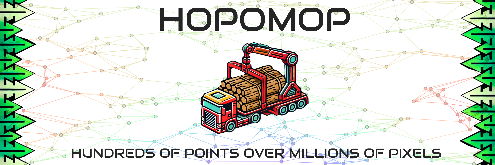
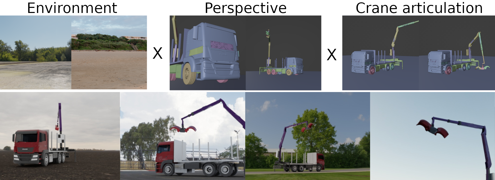
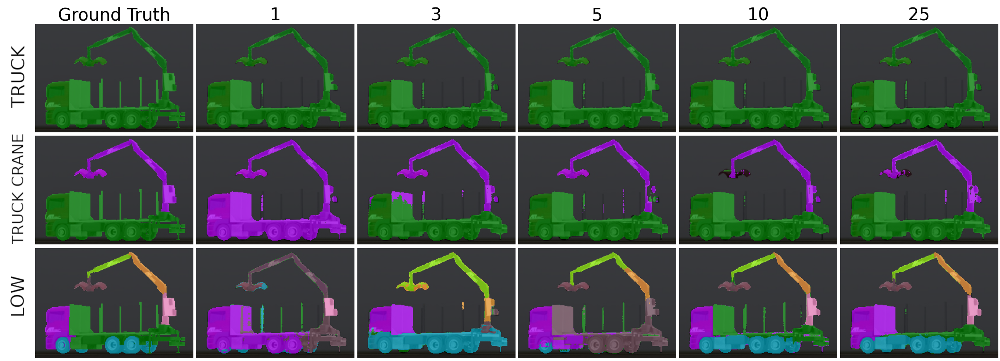
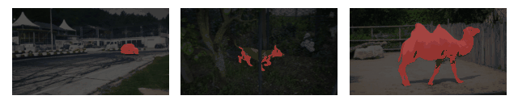
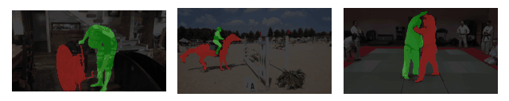

<!DOCTYPE html>
<html lang="en">
<head>
    <meta charset="UTF-8">
    <meta name="viewport" content="width=device-width, initial-scale=1.0">
    <title>HOPOMOP - Few-Shot Machinery Part Segmentation</title>
    <style>
        body {
            font-family: Arial, sans-serif;
            margin: 0;
            padding: 0;
            text-align: center;
            background-color: #f4f4f4;
        }
        header {
            background-color: white;
            color: black;
            padding: 20px;
            font-size: 24px;
        }
        .container {
            width: 80%;
            margin: 20px auto;
            background: white;
            padding: 20px;
            border-radius: 8px;
            box-shadow: 0 0 10px rgba(0, 0, 0, 0.1);
        }
        img {
            max-width: 100%;
            height: auto;
            border-radius: 8px;
        }
        .section {
            margin-bottom: 40px;
        }
        .authors {
            display: flex;
            justify-content: center;
            gap: 20px;
            flex-wrap: wrap;
        }
        .author {
            background: #f9f9f9;
            padding: 15px;
            border-radius: 8px;
            width: 250px;
            text-align: center;
        }
    </style>
</head>
<body>
    <header>
        <h1>HOPOMOP - Few-Shot Machinery Part Segmentation</h1>
    </header>
    <div class="container">
        <div class="section">
            <h2>Understanding HOPOMOP</h2>
            <p>HOPOMOP is an AI-powered system that segments machinery parts using few-shot learning. It combines foundation models and graph neural networks to accu[![Contributors][contributors-shield]][contributors-url]
[![Forks][forks-shield]][forks-url]
[![Stargazers][stars-shield]][stars-url]
[![Issues][issues-shield]][issues-url]
[![MIT License][license-shield]][license-url]

# HOPOMOP (Hundreds Of Points Over Millions Of Pixels)

[contributors-shield]: https://img.shields.io/github/contributors/AIT-Assistive-Autonomous-Systems/Hopomop.svg?style=for-the-badge
[contributors-url]: https://github.com/AIT-Assistive-Autonomous-Systems/Hopomop/graphs/contributors
[forks-shield]: https://img.shields.io/github/forks/AIT-Assistive-Autonomous-Systems/Hopomop.svg?style=for-the-badge
[forks-url]: https://github.com/AIT-Assistive-Autonomous-Systems/Hopomop/network/members
[stars-shield]: https://img.shields.io/github/stars/AIT-Assistive-Autonomous-Systems/Hopomop.svg?style=for-the-badge
[stars-url]: https://github.com/AIT-Assistive-Autonomous-Systems/Hopomop/stargazers
[issues-shield]: https://img.shields.io/github/issues/AIT-Assistive-Autonomous-Systems/Hopomop.svg?style=for-the-badge
[issues-url]: https://github.com/AIT-Assistive-Autonomous-Systems/Hopomop/issues
[license-shield]: https://img.shields.io/github/license/AIT-Assistive-Autonomous-Systems/Hopomop.svg?style=for-the-badge
[license-url]: https://github.com/AIT-Assistive-Autonomous-Systems/Hopomop/blob/master/LICENSE.txt

## Welcome to HOPOMOP 🎯

HOPOMOP is an advanced approach for understanding and segmenting machinery parts from images using cutting-edge AI. Whether you're working with industrial machines, robotics, or just interested in computer vision, our approach makes it easier to analyze complex mechanical structures—even with very little training data!

🚀 **Why HOPOMOP?**
- Works with just a few training examples 🏗️
- Uses powerful AI models for precise segmentation 🤖
- Bridges the gap between synthetic and real-world images 🌍

---

<div align="center">
  <a href="https://github.com/AIT-Assistive-Autonomous-Systems/Hopomop">
    
  </a>

  <p align="center">
    <a href="https://arxiv.org/abs/2501.10080">📖 Read the Paper</a>
  </p>
</div>

## How It Works 🔍
HOPOMOP combines different AI models to identify and segment parts of machines:
- **SuperPoint**: Detects key features in images 🏷️
- **CLIPSeg**: Understands objects based on text prompts 🔠
- **Segment Anything**: Quickly outlines objects with precision ✂️
- **Graph Neural Networks**: Connects important features for smarter predictions 🔗


## What We Used 🏗️
### 🔄 Domain Randomization
To make the model smarter, we trained it with AI-generated images that change backgrounds, lighting, and angles—just like in video games! 🎮




## Real-World Performance 🌍
### Few-Shot Segmentation
Even with a handful of training images, HOPOMOP can accurately detect and label machine parts:


### From Simulation to Reality
Trained on only 10 synthetic images, HOPOMOP successfully identifies parts on real machines:


### Tracking Objects Over Time
HOPOMOP can follow moving objects in videos, making it useful for industrial inspections and automation:

| Segmentation Type  | Example |
|----------------|----------------|
| One Class      |  |
| Two Classes    |  |
| Multi Classes  |  |

## Who We Are 👩‍🔬
HOPOMOP is developed at the [AIT Austrian Institute of Technology](https://www.ait.ac.at/) 🇦🇹, specializing in vision, automation, and control research.

| Researcher | Profile | Google Scholar |
|-----------|---------|---------------|
| **Michael Schwingshackl** 📧 [Michael.Schwingshackl@ait.ac.at](mailto:Michael.Schwingshackl@ait.ac.at) | [🔗 AIT Profile](https://publications.ait.ac.at/de/persons/michael-schwingshackl) | [🔗 Scholar](https://scholar.google.at/citations?user=fsvMYQYAAAAJ&hl) |
| **Fabio Francisco Oberweger** 📧 [Fabio.Oberweger@ait.ac.at](mailto:Fabio.Oberweger@ait.ac.at) | [🔗 AIT Profile](https://publications.ait.ac.at/de/persons/fabio.oberweger) | [🔗 Scholar](https://scholar.google.at/citations?hl=de&user=njm6I3wAAAAJ) |
| **Markus Murschitz** 📧 [Markus.Murschitz@ait.ac.at](mailto:Markus.Murschitz@ait.ac.at) | [🔗 AIT Profile](https://publications.ait.ac.at/de/persons/markus.murschitz) | [🔗 Scholar](https://scholar.google.at/citations?hl=de&user=S8yQbTQAAAAJ) |

## Want the Full Dataset? 📦
We provide a small sample to get you started. If you're interested in using the complete dataset for research, feel free to reach out!

## Cite HOPOMOP 📚
If you use our work, please cite us:
```
@InProceedings{Schwingshackl_2025_WACV,
    author    = {Schwingshackl, Michael and Oberweger, Fabio F. and Murschitz, Markus},
    title     = {Few-Shot Structure-Informed Machinery Part Segmentation with Foundation Models and Graph Neural Networks},
    booktitle = {Proceedings of the Winter Conference on Applications of Computer Vision (WACV)},
    month     = {February},
    year      = {2025},
    pages     = {1989-1998}
}
```